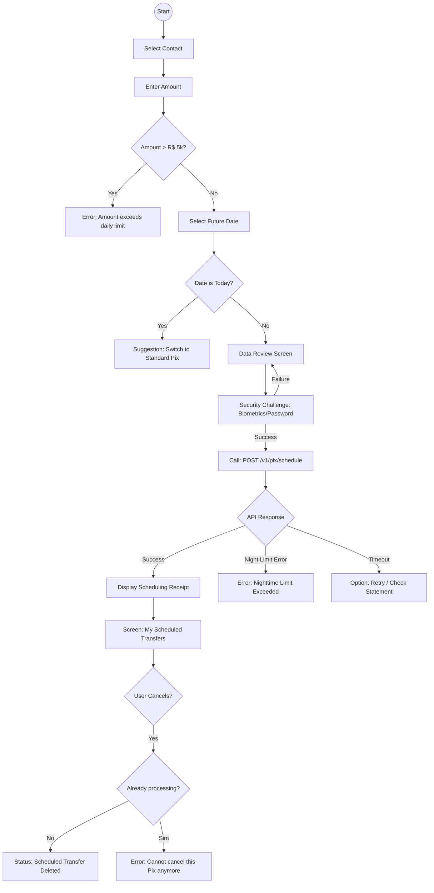

As a Software Architect and UX Specialist, I conducted a second round of in-depth analysis, focusing on technical implementation aspects (MFA, concurrency, and dynamic limits) that are critical for financial systems.

---

### 1. Risk Analysis (Requirement Blind Spots)

- **Nighttime Limit (BCB Resolution):** The ticket cites a limit of R$ 5,000.00 but overlooks Central Bank rules for the nighttime period (typically between 8 PM and 6 AM), where the limit is usually R$ 1,000.00. The system must validate whether the scheduled transaction violates the limit applicable to the time it will actually be _executed_.
- **Cancellation Window:** Until what time can the user cancel? (e.g., 11:59 PM the day before, or right up to the moment of settlement on the day itself?). A "Scheduling in Process" lock mechanism needs to be defined.
- **Key Obsolescence:** What happens if the recipient's Pix key is deleted or ported to another bank between the time of scheduling and execution? The scheduling UI requires an "Invalid Key Alert" state.
- **MFA/Security:** The requirement does not mention the security challenge (biometrics/password). A scheduled transfer is a promise to transfer funds and **must** require strong authentication at the time of creation.
- **Future Balance Concurrency:** If a user schedules five transfers of R$ 1,000.00 for the same day but only has R$ 1,000.00 in the account, what priority criteria will the payment engine use? (Chronological order of creation or transaction amount?). ---

### 2. UI State Mapping (Dev Checklist)

#### **Data Input and Validation**

- `Date Picker Restriction`: Past days and the current day must be disabled (greyed out) to prevent "Standard Pix" errors.
- `Amount Feedback`: If the amount > 5000, the "Continue" button must be disabled, accompanied by helper text explaining the reason.
- `Insufficient Funds (Soft Warning)`: A visual warning if the scheduled amount exceeds the current balance (good UX practice, even for future-dated Pix transfers).

#### **Processing and Security**

- `Biometric/PIN Challenge`: Authentication modal prior to final confirmation.
- `Processing State`: Spinner with the text "Registering schedule with the Central Bank..."

#### **Schedule Management (List Screen)**

- `Empty State`: Illustration and text inviting the user to create their first scheduled transfer.
- `Cancellation Loading`: Specific loading state on the item being cancelled to prevent double-clicks.
- `Error State (Cancellation)`: Feedback if the user attempts to cancel a Pix transfer that has already entered the settlement processing stage.

#### **Receipt**

- `Print/Share State`: Receipt version optimized for screenshots or PDF sharing. ---

### 3. Logic Flow (Mermaid.js)

### Considerations for the Front-End Developer:

1.  **Smart Redirection:** If the user selects "Today" in the calendar, do not simply show an error; offer a "Make Pix Now" button that carries over the pre-filled contact and amount.
2.  **Accessibility:** Ensure the `Date Picker` is keyboard-navigable and that screen readers clearly announce that this is a transaction scheduled for the future. 3. **Idempotency:** Ensure the confirmation button sends an `x-idempotency-key` in the API header to prevent duplication in cases of network instability (3G/4G).
